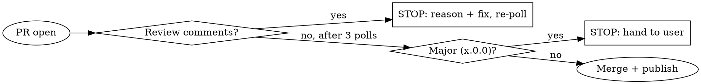

# Publish Release Runbook

## Overview

The repeatable end-of-branch workflow for shipping `darthmolen.copilot-cli-extension` to the
VS Code Marketplace. Deterministic 9 steps with two hard STOP gates (major version, review
comments). Follow it in order; do not skip the gates.

**Publisher:** `darthmolen` · **Extension:** `copilot-cli-extension` · **Publish:** tag-triggered
`release.yml` GitHub Action (`vsce publish`); local `vsce` is the fallback · **PR tool:** `gh`
(authed as darthmolen) · **PAT:** repo secret `VSCE_PAT` for CI; `MarketplaceAdoPat` in `.env`
(gitignored) for the local fallback.

## Non-negotiables

- **Publishing happens on `main` only** — via the tag-triggered Action (tag pushed on main), or the local fallback which re-confirms `git branch --show-current` = `main` first.
- **The tag must equal `package.json` version.** The Action guards this and fails the release on mismatch; don't tag until they match.
- **Never print, echo, log, or commit `.env` or the PAT.** In CI the PAT is the `VSCE_PAT` secret. Locally, read it into a var at point of use, pass via the `VSCE_PAT` env (not argv), and `unset` it.
- **Never stage `.env`.** Verify it is not staged before committing (step 4).
- **STOP on a major/breaking change** (breaking/architectural rewrite OR version `x.0.0`) — hand back to the user (step 7).
- **STOP on human review comments** — evaluate before merging (step 6).
- **No AI attribution** in commits, PR titles/bodies, tags, or release notes (per CLAUDE.md branding).

## The two STOP gates



## Steps

### 1. Verify a unique branch (not main)
```bash
BRANCH=$(git branch --show-current)
[ "$BRANCH" = "main" ] && { echo "On main — create a feature branch first"; exit 1; }
```

### 2. Determine the version from the LAST PUBLISHED version
The marketplace is authoritative — do not trust local tags/package.json (they lag or lead).
Parse the labeled `Version:` line, not the first number in the output — `vsce show` prints a version
*table* near the top as well, and the first semver in it is the same value only by luck of ordering.
```bash
PUBLISHED=$(npx vsce show darthmolen.copilot-cli-extension 2>/dev/null \
  | grep -iE '^\s*Version:' | grep -oE '[0-9]+\.[0-9]+\.[0-9]+' | head -1)

# STOP if empty, whatever the cause. An unparsed $PUBLISHED makes the duplicate
# guard below pass vacuously — every comparison against "" succeeds — so the first
# thing you would learn is a rejected publish.
[ -n "$PUBLISHED" ] || { echo "Could not read the published version; re-run, then check 'npx vsce show' by hand"; exit 1; }

CURRENT=$(node -p "require('./package.json').version")
echo "published=$PUBLISHED  package.json=$CURRENT"
```

> **A cold `npx vsce` can return empty** — observed once in a freshly created worktree during the
> 3.12.1 release, where the same command succeeded on the next invocation. The parser was fine; the cold
> first run was not. So: **re-run before concluding anything about the format**, and never proceed on an
> empty value. That is what the guard above is for.

Pick the next version relative to `$PUBLISHED` (table below). Then **make `package.json` `version`
equal that value**. Edit it **surgically** — `sed -i '0,/"version": "X"/s//"version": "Y"/'` or an
equivalent one-line change. Do **not** rewrite the file with `JSON.parse` + `JSON.stringify`: that
reformats all ~440 lines and buries a one-line bump in an unreviewable diff.

Guard: if the chosen version is **≤ `$PUBLISHED`**, STOP — you are not ahead of the marketplace and
the publish would be rejected as a duplicate.
See CLAUDE.md "Versioning" — when in doubt, bump minor.

| Change kind | Bump | From 3.10.0 → |
|---|---|---|
| New feature / UI / capability, or a batch of fixes | **minor** (reset patch) | `3.11.0` |
| Single small bug fix, no new capability | **patch** | `3.10.1` |
| Breaking / architectural rewrite | **major** | `4.0.0` → **STOP at step 7** |

The bump decision also feeds the step-7 gate: if this is a **breaking/architectural** change,
it is a major release regardless of the number you typed — treat it as major at step 7.

### 3. Pre-flight gate — must be green before committing
**This LOCAL run is the ONLY place tests execute — CI does not run the suite yet** (known flake
tail), so do not skip it.
```bash
npm run compile && npm test && ./test-extension.sh
```

Run `npm test` **twice**. A single green run is not evidence — see CLAUDE.md; the suite's flake
rotates its victim, so one clean pass proves as little as one red one.

**If another worktree is in use** (see the `worktree-init` skill), `./test-extension.sh` is the step
to think about: it runs `code --install-extension … --force`, which is **global to VS Code**, and
whichever tree ran it last wins silently. Either coordinate before running it, or skip the install
and say so in the PR — do not report the gate as fully green when part of it was skipped. Note that
`npx vsce package` is **not** a substitute from a symlinked worktree: it fails with `EISDIR`
(details in `worktree-init`). CI packages from a clean checkout, so the published artifact is
unaffected either way.

Only `main.js size constraint` is an accepted baseline failure. Any other failure must be
**re-run in isolation** (`npx mocha <file> --timeout <n>`) and pass there before you proceed —
do not wave a failure through as "probably flaky."

### 4. Commit + push the branch
Guard: never stage secrets.
```bash
git add -A
git diff --cached --name-only | grep -qx '.env' && { echo ".env is staged — abort"; git restore --staged .env; }
git commit -m "vX.Y.Z: <concise summary>"     # NO AI attribution
git push -u origin "$BRANCH"
```

### 5. Open the PR to main
Title matches history (`vX.Y.Z: <summary>`); body summarizes the change.
```bash
gh pr create --base main --head "$BRANCH" --title "vX.Y.Z: <summary>" --body "<what/why + test results>"
PR=$(gh pr view --json number -q .number)
```

### 6. Poll for review comments — 3 times, ~5 minutes apart (≈15 min window)
This is a main-loop step: pace the loop with **ScheduleWakeup** (`delaySeconds: 300`,
`reason: "polling PR #$PR for review"`), re-firing up to 3 times. (ScheduleWakeup is a main-agent
tool; if you are a subagent without it, sleep-wait ~5 min between checks instead.) On each wake:
```bash
gh pr view "$PR" --json reviewDecision,reviews,comments
gh api "repos/darthmolen/copilot-cli-extension/pulls/$PR/comments"   # inline review comments
```

**BREAK the poll immediately on ANY human review comment or `reviewDecision=CHANGES_REQUESTED`.**

Then **REQUIRED SUB-SKILL:** use `superpowers:receiving-code-review` to evaluate each point on its
merits (verify, don't blindly comply), make the warranted fixes, `git push`, and **restart the poll
from step 6**. Only when a full poll cycle finds no comments do you continue to step 7.

Also require the **`CI` check to be green** on the PR before merging (`gh pr checks "$PR"`).
(CI runs the deterministic type-check + lint + bundle only — not the test suite yet — so the
step-3 local run is your real test gate.)

### 7. Gate on major/breaking, else squash-merge to main
- **If this is a major/breaking release — a breaking or architectural change, OR the version is
  `x.0.0`: STOP.** Tell the user it's a major release and wait for explicit approval before
  merging/publishing. Do not run `gh pr merge`, `vsce publish`, or tag.
- Otherwise squash-merge (matches the `vX.Y.Z: … (#N)` history):
```bash
gh pr merge "$PR" --squash    # add --admin only if branch protection blocks AND the poll was clean
```

### 8. Switch to main and pull
```bash
git checkout main && git pull origin main
```

### 9. Tag on main → the Action publishes → celebrate 🎉
Publishing is done by the **`release.yml` GitHub Action** (tag-triggered). You just push the tag;
CI guards `tag == package.json version`, runs compile + unit tests, `vsce publish`es, and cuts the
GitHub release. Requires the repo secret **`VSCE_PAT`** (= the `MarketplaceAdoPat` value).
```bash
[ "$(git branch --show-current)" = "main" ] || { echo "not on main — abort"; exit 1; }
VER=$(node -p "require('./package.json').version")
git tag "v$VER" && git push origin "v$VER"
# Follow the publish:
gh run watch "$(gh run list --workflow=release.yml -L1 --json databaseId -q '.[0].databaseId')" --exit-status
```
Confirm the new version on the marketplace (`npx vsce show darthmolen.copilot-cli-extension`), then celebrate.

**Fallback (CI down / secret missing):** publish locally from `main` only — guard the branch, keep
the PAT off argv, tag only after publish succeeds:
```bash
[ "$(git branch --show-current)" = "main" ] || exit 1
trap 'unset PAT VSCE_PAT' EXIT
PAT=$(grep '^MarketplaceAdoPat=' .env | cut -d= -f2-)
VSCE_PAT="$PAT" npx vsce publish        # env, not argv
VER=$(node -p "require('./package.json').version"); git tag "v$VER" && git push origin "v$VER"
```

## Quick reference

| Step | Command / action |
|---|---|
| 1 branch | `git branch --show-current` ≠ `main` |
| 2 version | `npx vsce show …` → next per table → set package.json |
| 3 gate | `npm run compile && npm test && ./test-extension.sh` |
| 4 push | `git commit -m "vX.Y.Z: …"` → `git push -u origin $BRANCH` |
| 5 PR | `gh pr create --base main --title "vX.Y.Z: …"` |
| 6 poll | ScheduleWakeup 300s ×3; `gh pr view/api … comments`; break on ANY comment |
| 7 merge | breaking/major → STOP; else `gh pr merge $PR --squash` |
| 8 main | `git checkout main && git pull` |
| 9 ship | guard on-main → `git tag vX.Y.Z && git push origin vX.Y.Z` → `release.yml` Action publishes; `gh run watch` |

## Common mistakes

- **Publishing from the feature branch.** Publishing happens at step 9 on `main` — via the tag, or
  the on-main-guarded local fallback. The VSIX built on the branch is for local testing only.
- **Tagging before `package.json` is bumped/merged on main.** The Action fails when `tag != package.json`.
  Bump (step 2), merge to main (step 7), pull (step 8), *then* tag.
- **Bumping from `package.json` instead of the marketplace.** Local version/tags can be ahead or
  stale; `vsce show` is the source of truth for "last published".
- **Merging a major without asking.** `x.0.0` always stops for the user.
- **Continuing past review comments** because they "seem minor" — evaluate every one first.
- **Leaking the PAT** by echoing `.env` or passing it on a logged command line in plain view.
