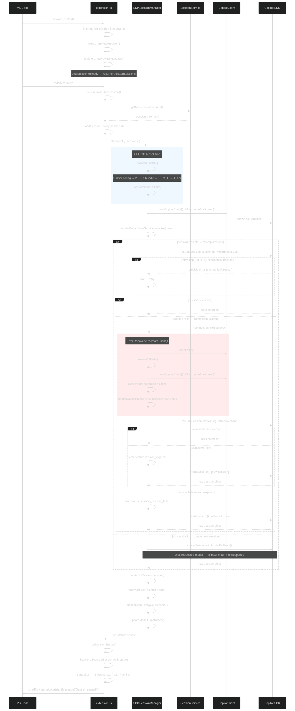
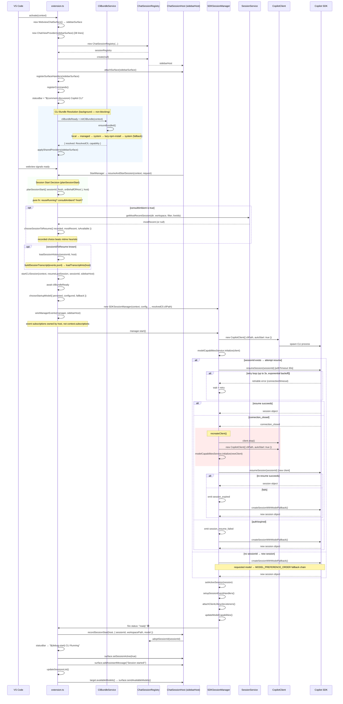

# Session Startup

**Version**: 3.14.0
**Last Updated**: 2026-08-22

## Overview

This document describes the full startup flow from VS Code activating the extension through to a session emitting a `ready` status. It covers CLI bundle resolution, `ChatSessionHost` and `ChatSessionRegistry` construction, `SDKSessionManager` creation, session resumption with retry logic, error recovery, and final UI activation.

The startup is broken down into 6 phases:

activation → CLI bundle resolution (background) → session start decision → `startCLISession()` → SDK session resume/create → post-start UI activation

> **v3.13.0 architectural context:** `chatViewProvider.ts` shrank from 1,011 lines to 38 — it is now the sidebar's registration only. All session state moved from module-level globals into `ChatSessionHost`, one per conversation. Every surface has its own host. Two sessions can run simultaneously (sidebar + tab) without interleaving. See `documentation/4.0-README.md` for the full story.

---

## Phase 1: Extension Activation (`extension.ts → activate()`)

**Entry point:** `activate(context: vscode.ExtensionContext)`

1. **Create `WebviewChatSurface`** (`sidebarSurface`) — N-instancable, surface = webview + RPC router + host slot
2. **Create `ChatViewProvider`** (38 lines) — just registers the sidebar with VS Code
3. **Create `ChatSessionRegistry`** (`sessionRegistry`) — tracks every live host in this window
   - Given a `createStartManager` factory that calls `resumeAndStartSession()` when a host asks
4. **Create `sidebarHost`** — `sessionRegistry.create(null)` (no session ID yet)
   - `sidebarHost.attachSurface(sidebarSurface)` — wires host ↔ surface
   - `sidebarSurface.setSessionHost(sidebarHost)`
5. **Create `ChatPanelService`** (`chatPanels`) — opens/restores editor-tab chat panels
6. **Create `SubagentPanelService`** (`subagentPanels`) — pop-out sub-agent activity panels
7. **Register `WebviewPanelSerializer`** — VS Code calls `chatPanels.restore()` to revive closed tab sessions during activation
8. **`registerSurfaceHandlers(context, sidebarSurface)`** — wires RPC for the sidebar
9. **`registerCommands(context)`** — registers all VS Code commands
10. **Status bar** created: `$(comment-discussion) Copilot CLI`
11. **`cliBundleReady = initCliBundle(context)`** — starts CLI bundle resolution in the background (async, non-blocking)

---

## Phase 2: CLI Bundle Resolution (background — `initCliBundle()`)

**Triggered by:** activation (fire-and-forget, runs in parallel with webview boot)

`CliBundleService.ensureBundled()` resolves the Copilot CLI binary in priority order:

| Priority | Source | Path |
|----------|--------|------|
| 1 | **local** | `<extensionPath>/node_modules/@github/copilot` — dev / F5 |
| 2 | **managed** | `<globalStorageUri>/cli/<peer-range>/node_modules/@github/copilot` |
| 3 | **system** | `which copilot` (if satisfies SDK peer dep range) |
| 4 | **lazy install** | `npm install @github/copilot@<peer-range>` into managed dir, then return managed |
| 5 | **system (fallback)** | accepts system binary even if it doesn't satisfy peer dep, with a warning |
| ❌ | **failure** | throws if no binary found at all |

After resolution:
- **`bootstrapCliBundle()`** returns `{ resolved: ResolvedCli, capability: CliCapabilityService }`
- Stores `resolvedCli` and `resolvedCapability` as module-level values
- **`applySharedProviders(context, sidebarSurface)`** — wires MCP list provider + CLI capability onto the surface (and any subsequently created tab surfaces)
- If the resolved version does not satisfy the SDK peer dep range, a VS Code warning toast is shown

`startCLISession()` **awaits `cliBundleReady`** before spawning the SDK process, so the extension never races against an in-progress `npm install`.

---

## Phase 3: Session Start Decision (`resumeAndStartSession()`)

**Triggered by:** webview signals ready → `ChatSessionHost` asks its `StartManager` → `resumeAndStartSession(context, request)`

### Step 3a: `planSessionStart()` — decide what to do

```typescript
const plan = planSessionStart(
    { sessionId, fresh, onBehalfOfHost },
    { isRunning: () => target.isLive, getSessionId: () => target.sessionId }
);
```

`planSessionStart` is a pure function (no `vscode` / SDK imports). It returns a `SessionStartPlan`:

| Input | `reuseRunning` | `consultAmbient` | `fresh` |
|-------|---------------|-----------------|---------|
| No session named, this host already live | ✅ true | — | false |
| No session named, host not live | false | ✅ true | false |
| Session named, host already has it | ✅ true | — | false |
| Session named, host doesn't have it | false | false | false |
| `fresh: true` | false | false | ✅ true |
| `onBehalfOfHost: true` | false | ✅ true | false |

If `plan.reuseRunning` → return early (nothing to do).

### Step 3b: `determineSessionToResume()` (when `consultAmbient` is true)

```typescript
const sessionId = chooseSessionToResume({
    recorded: context.workspaceState.get(SIDEBAR_SESSION_KEY),  // the user's last explicit choice
    mostRecent: SessionService.getMostRecentSession(sessionStateDir, workspaceFolder, filterByFolder, liveSessionIds),
    isAvailable: (id) => !liveSessionIds.includes(id) && SessionService.isRestorable(sessionStateDir, id)
});
```

`chooseSessionToResume` is a pure function (no `vscode` imports). Priority:
1. **`recorded`** — the last session the user explicitly chose for the sidebar (wins if it exists and is available)
2. **`mostRecent`** — mtime-most-recent session on disk (fallback)

Sessions already showing in another surface (`liveSessionIds`) are excluded from both candidates.

> **A directory is not a session — but "resumable" is not the test either.** `isAvailable` first
> tested `fs.existsSync(<dir>)`, which is weaker than the `events.jsonl` test `getMostRecentSession`
> applies: a work session abandoned for plan mode before any message has a directory and no
> transcript, and `session.resume` answers `Session not found` — the "Previous session not found"
> dialog.
>
> Tightening both paths to `hasSessionHistory()` then broke the other direction. Bringing back a
> **work** session means `session.resume`, which needs a transcript. Restoring a **plan** session means
> `enablePlanMode()`, which *creates* the plan session when there is none — so it needs only the work
> id the pairing gives it. Enter plan mode, close VS Code before typing anything, and the paired plan
> session has no transcript; requiring one discarded a real "I was planning" intent and fell back to a
> stale work session.
>
> `SessionService.isRestorable()` holds both rules: transcript required for work, pairing sufficient
> for plan. (v4.1.0)

**What gets recorded.** `recordSidebarSession` fires when a session starts, when the user switches,
and — since v4.1.0 — on `plan_mode_enabled` / `plan_mode_disabled`, so the record names the half that
is actually active. Without that last one the record kept naming the work half and plan mode silently
never came back after a restart.

### Step 3c: Load transcript (if resuming)

If a `sessionIdToResume` was determined:
```typescript
await loadSessionHistory(sessionId, target);
// → buildSessionTranscript(eventsPath)  // reads events.jsonl, returns Message[]
// → loadTranscriptInto(target, messages)  // host.state.setMessages(messages)
```

Transcript loading is host-targeted — it writes to `target.state`, not to a singleton.

---

## Phase 4: `startCLISession()` — Build & Start the Manager

**In:** `startCLISession(context, resumeLastSession, specificSessionId, target)`

1. **Await `cliBundleReady`** — blocks until the CLI bundle is resolved (safe to call multiple times)

2. **Model selection** (for resume only):
   ```typescript
   config.model = chooseStartupModel({
       persisted: SessionService.readSessionModel(sessionStatePath(specificSessionId)),
       configured: vscode.workspace.getConfiguration('copilotCLI').get('model'),
       fallback: DEFAULT_MODEL
   });
   ```
   `chooseStartupModel` is a pure function. Persisted model wins over configured default, so a model switched mid-session survives a reload.

3. **Create `SDKSessionManager`** (local variable, not a module global):
   ```typescript
   const manager = new SDKSessionManager(
       context, config, resumeLastSession, specificSessionId,
       resolvedCli?.cliPath,          // from CliBundleService
       createVSCodeHostBridge(context, { getActiveAgent: () => target.state.getActiveAgent() })
   );
   ```

4. **`wireManagerEvents(manager, target)`** — subscribes all manager events, **registered against `target` (the host)**, not against `context.subscriptions`
   - Session-conversation events (output, reasoning, tools, diffs) route through `target.attachManager(manager)` to that host's surface
   - Window-scoped events (status bar, toasts, sub-agent panels, MCP state) are handled inline

5. **`await manager.start()`** — spawns CLI process and resumes/creates SDK session (Phase 5)

6. **`onSessionStarted(manager, target, config.model)`** — post-start UI wiring (Phase 6)

---

## Phase 5: `SDKSessionManager.start()` — CLI Process & SDK Session

**In:** `SDKSessionManager.start()`

### CLI Process — `CopilotClient` creation

```typescript
this.client = new CopilotClient({
    logLevel: 'info',
    cliPath,          // from resolvedCli?.cliPath (passed in from startCLISession)
    cliArgs: ['--no-auto-update', ...(yolo ? ['--yolo'] : [])],
    cwd: this.workingDirectory,
    autoStart: true,  // spawns CLI process immediately
});
```

Then: `await this.modelCapabilitiesService.initialize(this.client)`

### If the session is a plan half — restore plan mode

Checked first, before any resume. The role comes from `resolveStartupPairing(stateDir, sessionId)` —
never from an `endsWith('-plan')` here; `sessionPairing.ts` is the only module allowed to know that
convention, and this file was the reader that taught the others by example.

```typescript
const startupPairing = this.sessionId ? resolveStartupPairing(startupStateDir, this.sessionId) : null;
const restoringPlanMode = startupPairing?.role === 'plan';
if (restoringPlanMode) {
    this.sessionId = startupPairing.workId;   // enablePlanMode() derives from this
}
```

When restoring:

1. **No work session is resumed or created.** `this.session` stays `null`;
   `setupSessionEventHandlers()` already no-ops on that.
2. `enablePlanMode()` runs **before** the `ready` event — it resumes the plan session (conversation
   and tool restrictions intact) and calls `setActiveSession(planSession)`.
3. `ready` then fires carrying the **plan** session id, so the surface never sees a work id that is
   not live.
4. The work session is minted later, by `disablePlanMode()`, under the *derived* id — keeping the
   `<work>-plan` pairing and `plan.md` attached rather than orphaning them behind a fresh UUID.

Why not resume the work session first, as v4.0.0 did? Because it may not be resumable: entering plan
mode before sending anything leaves a work directory with no transcript. That path produced the
"Previous session not found" dialog. Evidence: `planning/spikes/plan-session-reuse/`.

### If `sessionId` exists — resume path

1. `attemptSessionResumeWithUserRecovery(sessionId, resumeOptions)`:
   - Wraps `this.client.resumeSession(sessionId)` with a 30 s timeout
   - **Retry logic** (up to 3×, exponential backoff) for retriable errors (connection, timeout)
   - Skips retries for `session_expired` and `authentication` errors

2. **If resume fails with `connection_closed`:**
   - Invoke `recreateClient()` — stops old CLI, re-resolves `cliPath`, spawns fresh `CopilotClient`, re-initializes model capabilities
   - Retry `resumeSession()` with new client
   - If re-resume fails → emit `session_expired`, fall through to new session

3. **If resume fails with auth/expired error:**
   - Emit `session_resume_failed` status
   - Fall through to new session creation

### If no `sessionId` — create new session

`createSessionWithModelFallback()`:
1. Try requested model via `this.client.createSession(config)`
2. If model unsupported: walk `MODEL_PREFERENCE_ORDER` (e.g. `claude-sonnet-4.6` → `gpt-5` → etc.) and retry with the first available model
3. On fallback success: notify user via toast + chat message
4. On all failures: throw error

Session config passed to `createSession()`:
```typescript
{
    model: this.config.model || undefined,
    tools: this.getCustomTools(),    // [] in work mode; plan mode tools in plan mode
    hooks: this.getSessionHooks(),   // onPreToolUse: captures file snapshots
    mcpServers: { ... }              // enabled MCP server configs
}
```

### Session activation

1. Store `this.workSession`, `this.workSessionId`, `this.currentMode = 'work'`
2. For new sessions: emit `reset_metrics` status
3. `setActiveSession(session)`:
   - `setupSessionEventHandlers()` — subscribes to `session.on()` for all SDK events
   - `attachClientLifecycleListeners()` — wires stderr, exit, connection lifecycle
4. `await this.updateModelCapabilities()`
5. If restoring plan mode: `await this.enablePlanMode()` — **before** `ready`, so the id announced is
   the plan session's
6. **🟢 Emit `ready`:**
   ```typescript
   this._onDidChangeStatus.fire({ status: 'ready', sessionId: this.sessionId });
   ```

---

## Phase 6: Post-Start UI Activation (`onSessionStarted()`)

**In:** `onSessionStarted(manager, target, startedOnModel)`

All writes go to `target` (the host), not to the `BackendState` singleton:

```typescript
recordSessionStart(target, {
    sessionId: manager.getSessionId(),   // target.adoptSessionId() → indexes host in registry
    workspacePath: manager.getWorkspacePath() || null,
    model: startedOnModel ?? getCLIConfig().model ?? null
});

const surface = target.getSurface();
statusBarItem.text = "$(debug-start) CLI Running";
surface?.setSessionActive(true);
surface?.setWorkspacePath(vsWorkspacePath);
surface?.setValidateAttachmentsCallback(/* this host's session */);
surface?.addAssistantMessage('Copilot CLI session started! How can I help you?');
updateSessionsList();
logger.show();

// Fire-and-forget: fetch models, send to webview
target.availableModels().then(models => surface?.sendAvailableModels(models));
```

Key difference from pre-v3.13: these writes target `target.state` (per-host `SessionState`), so starting a tab session does not mark the sidebar's conversation active or adopt the tab's id onto `sidebarHost`.

---

## Error Recovery: `recreateClient()`

**Trigger:** `connection_closed` error during session resume or message send.

Steps:
1. `await this.client.stop()` — gracefully stops the old CLI process
2. Re-resolve `cliPath` (the passed-in path, same resolution order — handles reinstalls)
3. `new CopilotClient({ cliPath, autoStart: true })` — spawns fresh CLI process
4. Clear model capabilities cache
5. `modelCapabilitiesService.initialize(newClient)` — re-queries available models

The caller retries the original operation (session resume or message send) with the new client.

---

## Session Switch Flow (`handleSwitchSession()`)

Session switching uses `planSessionSwitch()` — a pure function returning one of four outcomes:

| Outcome | Action |
|---------|--------|
| `already-here` | No-op — session is already on this surface |
| `reveal` | Show the other surface that owns this session; refuse to steal it |
| `reattach` | Tab was closed; `plan.host.attachSurface(surface)` — no new manager needed, cancels wind-down countdown |
| `resume` | Start a new manager against the session id on this surface's host |

---

## Key Sequences Summary

| Step | Location | What happens |
|------|----------|-------------|
| 1 | `activate()` | Creates sidebarSurface, sidebarHost, registry, chatPanels |
| 2 | `activate()` | `cliBundleReady = initCliBundle()` (background) |
| 3 | webview ready | `ChatSessionHost` → `StartManager` → `resumeAndStartSession()` |
| 4 | `planSessionStart()` | Decides whether / what / how to start (pure function) |
| 5 | `determineSessionToResume()` | `recorded` choice beats mtime heuristic; excludes live sessions |
| 6 | `loadSessionHistory()` | Projects `events.jsonl` → `Message[]` → `target.state` |
| 7 | `startCLISession()` | Awaits bundle, reads persisted model, creates `SDKSessionManager` |
| 8 | `wireManagerEvents()` | Events owned by host, not by `context.subscriptions` |
| 9 | `manager.start()` | `CopilotClient` spawned, session resumed or created |
| 10 | `fire('ready')` | 🟢 Manager signals ready |
| 11 | `onSessionStarted()` | `recordSessionStart(target, …)` — per-host, not singleton |
| 12 | surface activation | `setSessionActive`, `addAssistantMessage`, `sendAvailableModels` |

---

## Diagram




```mermaid
sequenceDiagram
    participant VSCode as VS Code
    participant Ext as extension.ts
    participant CBS as CliBundleService
    participant Registry as ChatSessionRegistry
    participant Host as ChatSessionHost (sidebarHost)
    participant SM as SDKSessionManager
    participant SS as SessionService
    participant CC as CopilotClient
    participant SDK as Copilot SDK

    VSCode->>Ext: activate(context)
    Ext->>Ext: new WebviewChatSurface() → sidebarSurface
    Ext->>Ext: new ChatViewProvider(sidebarSurface) [38 lines]
    Ext->>Registry: new ChatSessionRegistry(...)
    Registry-->>Ext: sessionRegistry
    Ext->>Registry: create(null)
    Registry-->>Host: sidebarHost
    Ext->>Host: attachSurface(sidebarSurface)
    Ext->>Ext: registerSurfaceHandlers(sidebarSurface)
    Ext->>Ext: registerCommands()
    Ext->>Ext: statusBar = "$(comment-discussion) Copilot CLI"

    rect rgb(240, 248, 255)
        note over Ext,CBS: CLI Bundle Resolution (background — non-blocking)
        Ext->>CBS: cliBundleReady = initCliBundle(context)
        CBS->>CBS: ensureBundled()
        note over CBS: local → managed → system → lazy-npm-install → system (fallback)
        CBS-->>Ext: { resolved: ResolvedCli, capability }
        Ext->>Ext: applySharedProviders(sidebarSurface)
    end

    VSCode->>Ext: webview signals ready
    Host->>Ext: StartManager → resumeAndStartSession(context, request)

    rect rgb(248, 255, 248)
        note over Ext: Session Start Decision (planSessionStart)
        Ext->>Ext: planSessionStart({ sessionId, fresh, onBehalfOfHost }, host)
        note over Ext: pure fn: reuseRunning? consultAmbient? fresh?
    end

    opt consultAmbient is true
        Ext->>SS: getMostRecentSession(dir, workspace, filter, liveIds)
        SS-->>Ext: mostRecent (or null)
        Ext->>Ext: chooseSessionToResume({ recorded, mostRecent, isAvailable })
        note over Ext: recorded choice beats mtime heuristic
    end

    opt sessionIdToResume known
        Ext->>Ext: loadSessionHistory(sessionId, host)
        note over Ext: buildSessionTranscript(events.jsonl) → loadTranscriptInto(host)
    end

    Ext->>Ext: startCLISession(context, resumeLastSession, sessionId, sidebarHost)
    Ext->>Ext: await cliBundleReady
    Ext->>Ext: chooseStartupModel({ persisted, configured, fallback })
    Ext->>SM: new SDKSessionManager(context, config, ..., resolvedCli.cliPath)
    Ext->>Ext: wireManagerEvents(manager, sidebarHost)
    note over Ext: event subscriptions owned by host, not context.subscriptions

    Ext->>SM: manager.start()

    SM->>CC: new CopilotClient({ cliPath, autoStart: true })
    CC->>SDK: spawn CLI process
    SM->>SM: modelCapabilitiesService.initialize(client)

    alt sessionId exists → attempt resume
        SM->>SDK: resumeSession(sessionId) [withTimeout 30s]

        alt retry loop (up to 3x, exponential backoff)
            SDK-->>SM: retriable error (connection/timeout)
            SM->>SM: wait + retry
        end

        alt resume succeeds
            SDK-->>SM: session object
        else connection_closed
            SDK-->>SM: connection_closed
            rect rgb(255, 235, 235)
                note over SM: recreateClient()
                SM->>CC: client.stop()
                SM->>CC: new CopilotClient({ cliPath, autoStart: true })
                SM->>SM: modelCapabilitiesService.initialize(newClient)
            end
            SM->>SDK: resumeSession(sessionId) [new client]
            alt re-resume succeeds
                SDK-->>SM: session object
            else fails
                SM->>SM: emit session_expired
                SM->>SDK: createSessionWithModelFallback()
                SDK-->>SM: new session object
            end
        else auth/expired
            SM->>SM: emit session_resume_failed
            SM->>SDK: createSessionWithModelFallback()
            SDK-->>SM: new session object
        end
    else no sessionId → new session
        SM->>SDK: createSessionWithModelFallback()
        note over SM,SDK: requested model → MODEL_PREFERENCE_ORDER fallback chain
        SDK-->>SM: new session object
    end

    SM->>SM: setActiveSession(session)
    SM->>SM: setupSessionEventHandlers()
    SM->>SM: attachClientLifecycleListeners()
    SM->>SM: updateModelCapabilities()
    SM->>Ext: fire status: "ready" 🟢

    Ext->>Host: recordSessionStart(host, { sessionId, workspacePath, model })
    Host->>Registry: adoptSessionId(sessionId)
    Ext->>Ext: statusBar → "$(debug-start) CLI Running"
    Ext->>Host: surface.setSessionActive(true)
    Ext->>Host: surface.addAssistantMessage("Session started!")
    Ext->>Ext: updateSessionsList()
    Ext->>Host: target.availableModels() → surface.sendAvailableModels()
```
