# Session Startup

## Overview

This document describes the full startup flow from VS Code activating the extension through to the session emitting a `ready` status. It covers CLI path resolution, `CopilotClient` creation, session resumption with retry logic, error recovery via client recreation, and the final UI activation steps.

The startup is broken down into 6 phases:

activation → session discovery → CLI path resolution → client creation → session resume with retry → error recovery with client recreation → ready emission.

---

## Phase 1: Extension Activation (`extension.ts`)

**Entry point:** `activate(context: vscode.ExtensionContext)`

1. Initialize `Logger` and `BackendState`
2. Create `ChatViewProvider` (sidebar UI)
3. Register chat provider event handlers via `registerChatProviderHandlers()`:
   - `onDidBecomeReady` → calls `resumeAndStartSession()`
   - `onDidReceiveUserMessage` → routes to `cliManager.sendMessage()`
   - `onDidRequestAbort` → calls `cliManager.abortMessage()`
4. Register VS Code commands (`start`, `newSession`, `switchSession`, etc.)
5. Status bar created showing `$(comment-discussion) Copilot CLI`

---

## Phase 2: Session Resume/Start

**Triggered by:** webview ready → `resumeAndStartSession()`

1. Check if session already running via `cliManager.isRunning()`
2. Determine session to resume via `determineSessionToResume()`:
   - Calls `SessionService.getMostRecentSession()`
   - Scans `~/.copilot/session-state/` directory
   - Filters by workspace folder (configurable)
   - Returns most recent session ID, or `null`
3. Load session history via `loadSessionHistory(sessionId)` — reads `events.jsonl`
4. Update UI session list via `updateSessionsList()`
5. Call `startCLISession(context, resumeLastSession, sessionIdToResume)`

---

## Phase 3: CLI Path Resolution & `CopilotClient` Creation

**In:** `startCLISession()` → `SDKSessionManager.start()`

### CLI Path Resolution — `resolveCliPath()`

Resolution order (first match wins):

| Priority | Source | Method |
|----------|--------|--------|
| 1 | User-configured path | `vscode.workspace.getConfiguration('copilotCLI').get('cliPath')` |
| 2 | SDK-bundled binary | `require.resolve('@github/copilot-{os}-{arch}')` |
| 3 | System PATH | `which`/`where copilot` (OS-dependent) |
| 4 | Failure | Throws error with installation link |

After resolution: `logCliVersion(cliPath)` executes `copilot --version --no-auto-update`.

### `CopilotClient` Creation

```typescript
this.client = new CopilotClient({
    logLevel: 'info',
    cliPath,
    cliArgs: ['--no-auto-update', ...(yolo ? ['--yolo'] : [])],
    cwd: this.workingDirectory,
    autoStart: true,   // spawns CLI process immediately
});
```

Then: `await this.modelCapabilitiesService.initialize(this.client)`

---

## Phase 4: Session Creation / Resumption

### If `sessionId` exists — resume path

1. Call `attemptSessionResumeWithUserRecovery(sessionId, resumeOptions)`
   - Wraps SDK's `this.client.resumeSession(sessionId)` with a 30s timeout
   - **Retry logic** (up to 3×, exponential backoff) for retriable errors (connection, timeout)
   - Skips retries for `session_expired` and `authentication` errors

2. **If resume succeeds** → proceed to Phase 5

3. **If resume fails with `connection_closed`:**
   - Invoke `recreateClient()` (see [Error Recovery](#error-recovery-recreateclient) below)
   - Retry `resumeSession()` with the new client
   - If re-resume succeeds → proceed to Phase 5
   - If re-resume fails → emit `session_expired`, fall through to new session creation

4. **If resume fails with auth/expired error:**
   - Emit `session_resume_failed` status
   - Fall through to new session creation

### If no `sessionId` — create new session

Call `createSessionWithModelFallback()`:
1. Try requested model via `this.client.createSession(config)`
2. If model unsupported:
   - Query available models via `ModelCapabilitiesService.getAllModels()`
   - Walk `MODEL_PREFERENCE_ORDER` list (`claude-sonnet-4.6` → `gpt-5`, etc.)
   - Retry with first available model (up to 3 fallback attempts)
   - On success: notify user via toast + chat message
   - On all failures: throw error, show settings message

### Session options passed to `createSession()`

```typescript
{
    model: this.config.model || undefined,
    tools: this.getCustomTools(),    // [] in work mode; plan mode tools in plan mode
    hooks: this.getSessionHooks(),   // onPreToolUse: captures file snapshots
    mcpServers: { ... }              // MCP server configs (if any enabled)
}
```

---

## Phase 5: Session Activation & Event Wiring

**In:** `SDKSessionManager.start()` (after session obtained)

1. Store session references: `this.workSession`, `this.workSessionId`, `this.currentMode = 'work'`
2. For new sessions: emit `reset_metrics` status
3. Call `setActiveSession(session)`:
   - `setupSessionEventHandlers()` — subscribes to `session.on()` for all SDK events
   - `attachClientLifecycleListeners()` — wires stderr, exit, connection lifecycle
4. `await this.updateModelCapabilities()`
5. **🟢 Emit `ready` status:**
   ```typescript
   this._onDidChangeStatus.fire({ status: 'ready', sessionId: this.sessionId });
   ```

---

## Phase 6: UI Activation (`extension.ts`)

**Handled by:** `wireManagerEvents()` + `onSessionStarted()`

```typescript
backendState.setSessionId(sessionId);
backendState.setSessionActive(true);
statusBarItem.text = "$(debug-start) CLI Running";
chatProvider.setSessionActive(true);
chatProvider.addAssistantMessage('Copilot CLI session started! How can I help you?');
updateSessionsList();
logger.show();
```

SDK event → chatProvider routing:

| SDK event | chatProvider method |
|-----------|---------------------|
| `onDidReceiveOutput` | `addAssistantMessage()` |
| `onDidReceiveReasoning` | `addReasoningMessage()` |
| `onDidChangeStatus('thinking')` | `setThinking(true)` |

---

## Error Recovery: `recreateClient()`

**Trigger:** `connection_closed` error during session resume or message send.

Steps:
1. `await this.client.stop()` — gracefully stops the old CLI process
2. `resolveCliPath()` — re-resolves CLI binary (handles updates/reinstalls)
3. `new CopilotClient({ cliPath, autoStart: true })` — spawns fresh CLI process
4. Clear model capabilities cache
5. `modelCapabilitiesService.initialize(newClient)` — re-queries available models

After recreation, the caller retries the original operation (session resume or message send) with the new client.

---

## Key Sequences Summary

| Step | Method | Notes |
|------|--------|-------|
| 1 | `activate()` | Initializes UI, registers handlers |
| 2 | `resumeAndStartSession()` | Determines `sessionId` to resume |
| 3 | `startCLISession()` | Creates `SDKSessionManager`, calls `start()` |
| 4 | `resolveCliPath()` | User config → SDK bundle → PATH → fail |
| 5 | `new CopilotClient()` | CLI process spawned (`autoStart: true`) |
| 6 | Resume or create | With retry / model fallback logic |
| 7 | `setActiveSession()` | Event handlers wired to session |
| 8 | `fire('ready')` | ✅ Extension ready to receive messages |

---

## Diagram

```mermaid
sequenceDiagram
    participant VSCode as VS Code
    participant Ext as extension.ts
    participant SM as SDKSessionManager
    participant SS as SessionService
    participant CC as CopilotClient
    participant SDK as Copilot SDK

    VSCode->>Ext: activate(context)
    Ext->>Ext: initLogger() + initBackendState()
    Ext->>Ext: new ChatViewProvider()
    Ext->>Ext: registerChatProviderHandlers()
    note over Ext: onDidBecomeReady → resumeAndStartSession()

    VSCode->>Ext: webview ready
    Ext->>Ext: resumeAndStartSession()
    Ext->>SS: getMostRecentSession()
    SS-->>Ext: sessionId (or null)
    Ext->>Ext: loadSessionHistory(sessionId)

    Ext->>SM: start(config, sessionId)

    rect rgb(240, 248, 255)
        note over SM: CLI Path Resolution
        SM->>SM: resolveCliPath()
        note over SM: 1. User config → 2. SDK bundle → 3. PATH → 4. Fail
        SM->>SM: logCliVersion(cliPath)
    end

    SM->>CC: new CopilotClient({ cliPath, autoStart: true })
    CC->>SDK: spawn CLI process
    SM->>SM: modelCapabilitiesService.initialize(client)

    alt sessionId exists → attempt resume
        SM->>SDK: resumeSession(sessionId) [withTimeout 30s]

        alt retry loop (up to 3x, exponential backoff)
            SDK-->>SM: retriable error (connection/timeout)
            SM->>SM: wait + retry
        end

        alt resume succeeds
            SDK-->>SM: session object
        else resume fails — connection_closed
            SDK-->>SM: connection_closed error
            rect rgb(255, 235, 235)
                note over SM: Error Recovery: recreateClient()
                SM->>CC: client.stop()
                SM->>SM: resolveCliPath()
                SM->>CC: new CopilotClient({ cliPath, autoStart: true })
                SM->>SM: clear model capabilities cache
                SM->>SM: modelCapabilitiesService.initialize(newClient)
            end
            SM->>SDK: resumeSession(sessionId) [with new client]
            alt re-resume succeeds
                SDK-->>SM: session object
            else re-resume fails
                SM->>SM: emit status: session_expired
                SM->>SDK: createSession() [new session]
                SDK-->>SM: new session object
            end
        else resume fails — auth/expired
            SM->>SM: emit status: session_resume_failed
            SM->>SDK: createSession() [fallback to new]
            SDK-->>SM: new session object
        end
    else no sessionId → create new session
        SM->>SDK: createSessionWithModelFallback()
        note over SM,SDK: tries requested model → fallback chain if unsupported
        SDK-->>SM: new session object
    end

    SM->>SM: setActiveSession(session)
    SM->>SM: setupSessionEventHandlers()
    SM->>SM: attachClientLifecycleListeners()
    SM->>SM: updateModelCapabilities()
    SM->>Ext: fire status: "ready" ✅

    Ext->>Ext: onSessionStarted()
    Ext->>Ext: backendState.setSessionActive(true)
    Ext->>Ext: statusBar → "$(debug-start) CLI Running"
    Ext->>VSCode: chatProvider.addAssistantMessage("Session started!")
```



