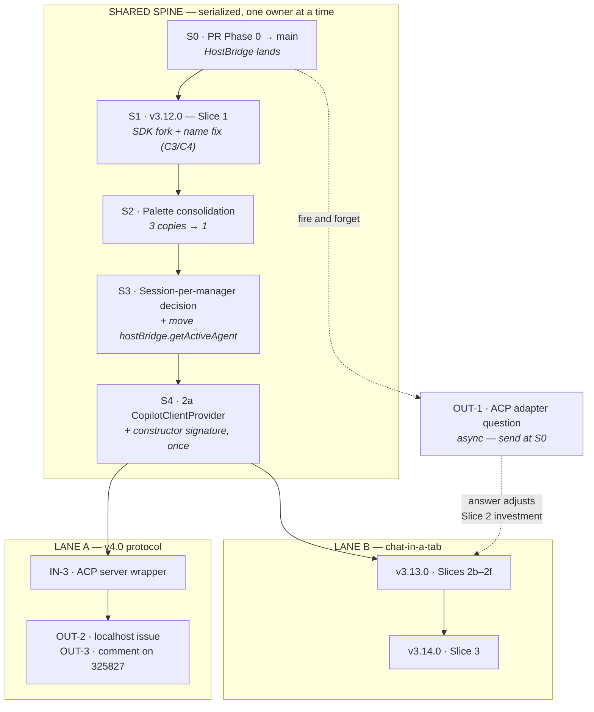

# ACP/AHP + Chat Tabs — Dual-Stream Work Order

**Canonical.** Two sessions are building on this repo at the same time. This is the single source of
truth for what happens in what order and who may touch which file. Both plans link here; neither
copies the diagram.

**Written:** 2026-08-15 · **Lane A:** v4.0 AHP/ACP split · **Lane B:** chat-in-a-tab

| Lane | Plan | Current state |
| --- | --- | --- |
| **A** | [v4.0-ahp-acp-split.md](roadmap/v4.0-ahp-acp-split.md) | Phase 0 complete, unmerged on `feature/4.0-phase0-decouple` |
| **B** | [chat-in-a-tab](needs-review/reviewed/2026-08-15-chat-in-a-tab-sdk-fork-forked-session-in-an-editor-tab.md) | Reviewed — "implementable with fixes" (4 critical) |

---

## Precedence

### Why a spine at all

`src/sdkSessionManager.ts` is 2532 lines and is the only genuinely contested file. Its **cores
separate cleanly** — roughly 490 lines are Lane A's alone (the 16 emitters, `_handleSDKEvent`, the
tool handlers, `abortMessage`) and 120 are Lane B's alone (client lifecycle, `recreateClient`,
`restart`). But **six seams collide**:

| Lines | Function | Why both |
| --- | --- | --- |
| 569–761 | `start()` | B extracts the client construction; A owns four `_onDidChangeStatus.fire()` calls inside it. **Worst single function for this pairing.** |
| 493–549 | `attemptSessionResumeWithUserRecovery()` | B: `client.resumeSession`. A: `approveAll` at :500 and headless `askSessionRecovery`. |
| 2330–2413 | `createSessionWithModelFallback()` | B: `client.createSession`. A: `approveAll` at :2339, emitter at :2400. |
| 1796–1829 | `stop()` | B owns teardown; A owns the `'stopped'` status fire at :1827. |
| 1414–1445, 1506–1510 | `sendMessage()` recovery path | Predominantly A, but calls into client recreation that B is changing. |
| 407–451, 2519–2532 | constructor + `dispose()` | Both add parameters at the same ~15 lines. |

The spine converts those six from cross-lane to intra-lane. After S4, ownership is exclusive and the
lanes genuinely run in parallel.

---

## The cut-out table

Once the spine lands, this is the contract. **Neither lane edits the other's files.**

| File | Owner | Note |
| --- | --- | --- |
| `src/sdkSessionManager.ts` | **Lane A exclusive** | After S4 the client lifecycle has left; what remains is A's region |
| `src/extension/hostBridge.ts` | **Lane A exclusive** | B's only need (`getActiveAgent`) is relocated in S3. Split + fallback removal deferred to the Lane A gate — [memo](backlog/hostbridge-split-and-fallback-seam.md) |
| `src/extension/services/CopilotClientProvider.ts` *(new, S4)* | A edits · **B consumes** | B constructs N managers against it and must not edit it |
| `src/extension.ts` | **Lane B exclusive** | 75 `chatProvider.` sites across 39 methods; A touches none |
| `src/chatViewProvider.ts` | **Lane B exclusive** | HTML + handler extraction |
| `src/backendState.ts` | **Lane B exclusive** | de-singleton |
| `src/extension/services/SessionService.ts` | **Lane B exclusive** | fork fallback, name helpers |
| `src/extension/services/cliCapabilityService.ts` | **Lane B exclusive** | may vanish entirely per review C3 |
| `src/extension/rpc/ExtensionRpcRouter.ts` | **Lane B exclusive** | read-mostly; already per-webview |
| `src/shared/messages.ts` | **Lane B exclusive** | ~2 lines, Slice 3 only |
| `src/extension/services/SubagentPanelService.ts` | **Lane B exclusive** | A reads it as reference only |
| New ACP files under `src/` | Lane A | Blank slate — zero ACP code in `src/` today |
| `src/extension/session/*`, `webview/chatHtml.ts`, `rpc/registerChatHandlers.ts`, `ChatPanelService.ts` | Lane B | New files, no contention |

### Rules of the road

1. **The spine is serialized.** Each step lands on `main` green before the next opens.
2. **After S4, no cross-lane edits.** A lane needing a change in the other's file files it as a new
   spine item rather than reaching across.
3. **Sync points:** S0 (both rebase), S4 (both rebase), and whenever OUT-1 is answered.
4. **New shared files become spine items.** If both lanes want to edit something new, it is a spine
   step, not a race.

---

## S3 — the decision neither plan owned

`setActiveSession()` ([sdkSessionManager.ts:762-769](../src/sdkSessionManager.ts#L762-L769)) assigns
`this._sessionSub.value`, a `MutableDisposable`. Subscribing to a new session **disposes the previous
subscription** — so one `SDKSessionManager` can emit for exactly one session at a time.

Both lanes trip over this for different reasons: Lane A's agent process serves N sessions, Lane B
needs N concurrent hosts. Neither plan assigned it an owner, and both would otherwise change the same
eight lines in the same week.

**Decision: do not change it. Adopt one-manager-per-session in both lanes.**

Lane B already wants one `SDKSessionManager` per `ChatSessionHost`. Lane A's agent process can do the
same — N managers against one shared `CopilotClientProvider`. This leaves plan mode's sequential
dual-session behaviour untouched, which matters because that is the one path the
[Phase 0.2 spike](spikes/acp-agent/FINDINGS.md) proved end to end (8/8 live, real `plan.md` write).

Revisit only if a lane finds a concrete case that one-manager-per-session cannot express.

**Also in S3:** move `getActiveAgent()` off `getBackendState()`
([hostBridge.ts:126-129](../src/extension/hostBridge.ts#L126-L129)). It is the last host coupling in
the file whose entire purpose is to have none, and it is Lane B's only reason to touch a Lane A file.

---

## Versioning

Review item I3 caught a collision: **`v4.0.0` and "Phase 0" are already claimed** by the AHP/ACP split,
whose Phase 0 is complete as of `a0595f5`. Corrected assignment:

| Work | Version |
| --- | --- |
| Slice 1 — SDK-native fork | **v3.12.0** |
| Slices 2b–2f — chat surface decoupling + tab | **v3.13.0** |
| Slice 3 — per-message fork | **v3.14.0** |
| AHP/ACP split | **v4.0.0** |

Per CLAUDE.md, a new editor-tab chat surface is a new capability with no breaking change — minor, not
major.

---

## Corrections to earlier counts

The contention map re-measured two figures quoted in the plan review:

- `getBackendState()` — **16 call sites**, not 21. `chatViewProvider.ts` ×12, `extension.ts` ×3,
  `hostBridge.ts` ×1, plus the definition at `backendState.ts:203`.
- `chatProvider.` in `extension.ts` — **75 sites across 39 distinct methods**. The review's figure was
  exact. Concentrated in `registerChatProviderHandlers` (~30) and `wireManagerEvents` (~28), which is
  the 2e core.

---

## Spine status

| Step | State | Landed as |
| --- | --- | --- |
| S0 · HostBridge / Phase 0 decouple | ✅ | PR #40 |
| S1 · SDK-native fork + name fix | ✅ | **v3.12.0** (published) |
| S2 · Palette consolidation | ✅ | v3.12.0 |
| S3 · Session-per-manager + `getActiveAgent` | ✅ | v3.12.0 |
| S4 · `CopilotClientProvider` | ✅ | `feature/s4-copilot-client-provider` |

**The spine is complete. Both lanes are open**, subject to the two notes below.

### What S4 actually delivered

`CopilotClientProvider` owns build → start → wire-diagnostics → replace → stop. `SDKSessionManager`
keeps a reference and no longer performs any of it; the create-and-start sequence that was duplicated
between `start()` and `recreateClient()` now exists once.

**Ownership is the contract Lane B consumes.** A manager *given* a provider is a consumer and must
not stop it; a manager that built its own owns it. Without that rule the first tab to close would
stop the shared CLI process out from under every other session.

**A latent defect went with it — latent, not live.** `_lifecycleListenersAttached` was reset in
`recreateClient()` but not in `stop()`, so a stop-then-start on the *same* manager would leave the
fresh client with no stderr, no exit code and no connection-close signal.

That path is unreachable in production, and an earlier draft of this section wrongly claimed
otherwise. `restart()` ([sdkSessionManager.ts:1889](../src/sdkSessionManager.ts#L1889)) is the only
caller and has **none of its own**; all three real `stop()` sites
([extension.ts:396](../src/extension.ts#L396), :421, :473) null the manager, and `startCLISession`
(:597) builds a new one with a fresh flag. `recreateClient()` always reset it correctly.

So this is correct-by-construction hardening, not a user-facing repair: the flag now changes only
where the client it describes changes. Mutation-checked — decoupling them again fails two tests.
**S4's justification does not rest on it**; the de-duplication and the ownership seam are the point.

**The constructor gained one optional trailing parameter.** `extension.ts` — Lane B's file — needed
no edit, so S4 touched nothing Lane B owns.

### Two things the lanes still need to settle

1. **Lane B: Slice 3 gates on `supportsSessionForkRpc`, which does not exist.** S1 shipped a runtime
   probe on `client.rpc.sessions.fork` plus a JSON-RPC `-32601` fallback instead, and deliberately
   skipped the `CliCapabilityService` flag. Slice 3's gating needs rewriting against the probe. This
   does not block Slices 2b–2f.
2. **Both lanes rebase now.** S4 is a declared sync point.
