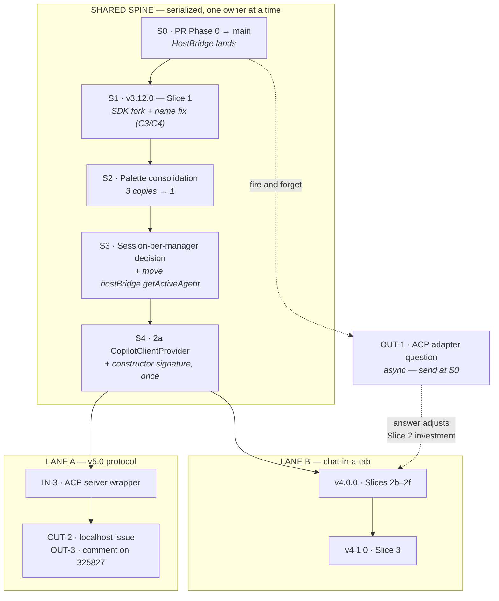

# ACP/AHP + Chat Tabs — Dual-Stream Work Order

**Canonical.** Two sessions are building on this repo at the same time. This is the single source of
truth for what happens in what order and who may touch which file. Both plans link here; neither
copies the diagram.

**Written:** 2026-08-15 · **Lane A:** v5.0 AHP/ACP split · **Lane B:** chat-in-a-tab (shipped v4.0.0)

| Lane | Plan | Current state |
| --- | --- | --- |
| **A** | [v5.0-ahp-acp-split.md](roadmap/v5.0-ahp-acp-split.md) | Phase 0 complete, unmerged on `feature/4.0-phase0-decouple` |
| **B** | [chat-in-a-tab](needs-review/reviewed/2026-08-15-chat-in-a-tab-sdk-fork-forked-session-in-an-editor-tab.md) | Reviewed — "implementable with fixes" (4 critical) |

---

## Precedence



### Why a spine at all

`src/sdkSessionManager.ts` is 2532 lines and is the only genuinely contested file. Its **cores
separate cleanly** — roughly 490 lines are Lane A's alone (the 16 emitters, `_handleSDKEvent`, the
tool handlers, `abortMessage`) and 120 are Lane B's alone (client lifecycle, `recreateClient`,
`restart`). But **six seams collide**:

| Lines | Function | Why both |
| --- | --- | --- |
| 569–761 | `start()` | B extracts the client construction; A owns four `_onDidChangeStatus.fire()` calls inside it. **Worst single function for this pairing.** |
| 493–549 | `attemptSessionResumeWithUserRecovery()` | B: `client.resumeSession`. A: `approveAll` at :500 and headless `askSessionRecovery`. |
| 2330–2413 | `createSessionWithModelFallback()` | B: `client.createSession`. A: `approveAll` at :2339, emitter at :2400. |
| 1796–1829 | `stop()` | B owns teardown; A owns the `'stopped'` status fire at :1827. |
| 1414–1445, 1506–1510 | `sendMessage()` recovery path | Predominantly A, but calls into client recreation that B is changing. |
| 407–451, 2519–2532 | constructor + `dispose()` | Both add parameters at the same ~15 lines. |

The spine converts those six from cross-lane to intra-lane. After S4, ownership is exclusive and the
lanes genuinely run in parallel.

---

## The cut-out table

Once the spine lands, this is the contract. **Neither lane edits the other's files.**

| File | Owner | Note |
| --- | --- | --- |
| `src/sdkSessionManager.ts` | **Lane A exclusive** | After S4 the client lifecycle has left; what remains is A's region |
| `src/extension/hostBridge.ts`, `vscodeHostBridge.ts` | **Lane A exclusive** | B's only need (`getActiveAgent`) is relocated in S3. Split + fallback removal **done** at the Lane A gate, 2026-08-19 — [memo](completed/hostbridge-split-and-fallback-seam.md) |
| `src/extension/services/CopilotClientProvider.ts` *(new, S4)* | A edits · **B consumes** | B constructs N managers against it and must not edit it |
| `src/extension.ts` | **Lane B exclusive** | 75 `chatProvider.` sites across 39 methods; A touches none |
| `src/chatViewProvider.ts` | **Lane B exclusive** | HTML + handler extraction |
| `src/backendState.ts` | **Lane B exclusive** | de-singleton |
| `src/extension/services/SessionService.ts` | **Lane B exclusive** | fork fallback, name helpers |
| `src/extension/services/cliCapabilityService.ts` | **Lane B exclusive** | may vanish entirely per review C3 |
| `src/extension/rpc/ExtensionRpcRouter.ts` | **Lane B exclusive** | read-mostly; already per-webview |
| `src/shared/messages.ts` | **Lane B exclusive** | ~2 lines, Slice 3 only |
| `src/extension/services/SubagentPanelService.ts` | **Lane B exclusive** | A reads it as reference only |
| New ACP files under `src/` | Lane A | Blank slate — zero ACP code in `src/` today |
| `src/extension/session/*`, `webview/chatHtml.ts`, `rpc/registerChatHandlers.ts`, `ChatPanelService.ts` | Lane B | New files, no contention |

### Rules of the road

1. **The spine is serialized.** Each step lands on `main` green before the next opens.
2. **After S4, no cross-lane edits.** A lane needing a change in the other's file files it as a new
   spine item rather than reaching across.
3. **Sync points:** S0 (both rebase), S4 (both rebase), and whenever OUT-1 is answered.
4. **New shared files become spine items.** If both lanes want to edit something new, it is a spine
   step, not a race.

### Each lane gets its own worktree

Both lanes are active at once, so they no longer share a checkout. Use the **`worktree-init`** skill
(`.claude/skills/worktree-init/`) rather than a bare `git worktree add` — a fresh worktree does not
get `research/` or `node_modules/`, both gitignored, and neither absence errors at setup time. A tree
missing `research/` silently makes CLAUDE.md's SDK-First rule unfollowable.

```
worktree-init <suffix> <branch> [base]      # e.g. lane-a feature/4.0-in3-acp-server main
```

| Lane | Worktree | Branch |
| --- | --- | --- |
| **B** | `vscode-copilot-cli-extension` (the original checkout) | `feature/3.13.0-chat-in-a-tab` |
| **A** | `vscode-copilot-cli-extension-lane-a` | `feature/4.0-in3-acp-server` |

**The one thing worktrees do not solve:** `./test-extension.sh` installs
`darthmolen.copilot-cli-extension` globally into VS Code, so only one lane's build can be installed
at a time and the last one to run wins **silently**. Lane A's IN-3 is out-of-host — spikes, unit
tests, type-checks — so it should rarely need a VSIX. Lane B needs the sidebar constantly.
**Coordinate before installing from the Lane A tree.**

`node_modules` is symlinked between the trees, so an `npm install` in either mutates both. Fine while
neither lane changes dependencies — neither plan calls for a new package, and IN-3 is explicitly
dependency-free. The trigger to watch is an **SDK upgrade**, which also moves the bundled CLI version
and is therefore loud. When that happens, break the symlink and install into each tree separately.

---

## S3 — the decision neither plan owned

`setActiveSession()` ([sdkSessionManager.ts:762-769](../src/sdkSessionManager.ts#L762-L769)) assigns
`this._sessionSub.value`, a `MutableDisposable`. Subscribing to a new session **disposes the previous
subscription** — so one `SDKSessionManager` can emit for exactly one session at a time.

Both lanes trip over this for different reasons: Lane A's agent process serves N sessions, Lane B
needs N concurrent hosts. Neither plan assigned it an owner, and both would otherwise change the same
eight lines in the same week.

**Decision: do not change it. Adopt one-manager-per-session in both lanes.**

Lane B already wants one `SDKSessionManager` per `ChatSessionHost`. Lane A's agent process can do the
same — N managers against one shared `CopilotClientProvider`. This leaves plan mode's sequential
dual-session behaviour untouched, which matters because that is the one path the
[Phase 0.2 spike](spikes/acp-agent/FINDINGS.md) proved end to end (8/8 live, real `plan.md` write).

Revisit only if a lane finds a concrete case that one-manager-per-session cannot express.

**Also in S3:** move `getActiveAgent()` off `getBackendState()`
([hostBridge.ts:126-129](../src/extension/hostBridge.ts#L126-L129)). It is the last host coupling in
the file whose entire purpose is to have none, and it is Lane B's only reason to touch a Lane A file.

---

## Versioning

Review item I3 caught a collision — **`v4.0.0` and "Phase 0" are already claimed by the AHP/ACP
split** — and the assignment below is the *second* correction, taken 2026-08-22.

**Chat-in-a-tab shipped as v4.0.0, not v3.13.0**, and the split moved up to v5.0.0.

| Work | Version | |
| --- | --- | --- |
| Slice 1 — SDK-native fork | **v3.12.0** | shipped |
| Slices 2b–2f — chat surface decoupling + tab | **v4.0.0** | **shipped** — was to be v3.13.0 |
| Slice 3 — per-message fork | **v4.1.0** | was v3.14.0 |
| AHP client half (IN-4, IN-6, IN-9) | **v5.0.0** | was v4.0.0 |
| **ACP agent (Lane A, IN-3 / IN-8)** | **no version — merges to `main` unreleased** | unchanged |

### Why chat-in-a-tab became major

It was planned as a minor on the reading that a new editor-tab surface is a new capability with no
breaking change. That reading was right about the *feature* and wrong about the *release*: the
feature is the smaller half, and what shipped with it was the largest backend restructuring since
1.x → 2.x — module-level session state replaced by per-conversation hosts, a registry, an observable
window state, a slot seam, and 75 call sites rerouted. `chatViewProvider.ts` went from 1,011 lines to
38. CLAUDE.md's own rule is that a **major** covers architectural rewrites, and this was one.

**And v4.0.0 was only reserved for the split by a schedule that no longer exists.** OUT-1 — the
question that decides the AHP client half — was posted 2026-08-15 and is still unanswered. Holding a
major for work blocked on someone else's reply, while shipping a rewrite underneath it as a point
release, has the numbering backwards.

So the split becomes **v5.0.0** and is looked at when Microsoft answers. Everything under
`planning/5.0/` was `planning/4.0/` before this decision; the directory was renamed with it so the
path and the version cannot drift apart.

### The ACP agent gets a merge, not a version — decided 2026-08-22

**This row was briefly given a version of its own and is now back where it started, and the reversal is worth recording
because the argument that moved it was retracted by the lane that made it.**

Lane A proposed shipping the ACP agent as its own release so that Zed users could install us. They
then measured, found the premise false, and said so: **`copilot --acp` is already in the ACP Registry**
as `@github/copilot@1.0.80 --acp`, auto-bumping hourly off npm while we bundle 1.0.68 by hand.
Probed side by side with the same battery, upstream advertises `authMethods` (registry CI requires
them; we advertise none), `image` and `embeddedContext` prompt capabilities, MCP capabilities and
three session modes. We are ahead on `session/fork`, `session/close` and `usage_update`. A registry
entry today would be a **near-duplicate that lags on version and advertises less**. Evidence:
`planning/spikes/acp-comparison/FINDINGS.md` on `feature/4.0-in3-acp-server` (named as text — read it
with `git show`, do not link across branches).

**So there is nothing to release, and a version number is a promise to users.** CLAUDE.md's own rule
is that a minor means a new capability; *"the extension is portable and the v5.0 boundary is proven"*
is not a capability anyone has. Numbering it would spend a version on an artefact no user can reach.

**But the work should merge, and soon, and those are different questions.** Lane A is 46+ commits and
75 files ahead of `main` with a four-file overlap against this branch. That divergence is a real cost
and it grows weekly; merging pays it down. The ACP agent is inert in a VSIX — `out/**` is
`.vscodeignore`d, esbuild never builds `src/acp/main.ts`, there is no `bin` — so it rides along in
v4.1.0's package at **zero bytes** and changes nothing a user sees.

What merges with it is not inert at all: **two defects a second consumer found that the sidebar could
not.** `ModelCapabilitiesService` was never initialised whenever the client provider was injected —
which is the single reason §4.7 did not ship in v3.13.0 — and `session/list` was offering plan halves
as conversations. That was always the better argument for this work than distribution.

**The row becomes a version when it has a door**, and only then: the separate npm package with a
`bin`, or IN-4 unblocking. Bundling into the VSIX is not that door and would be worse than waiting —

## Status

**Final Status:** Completed — both lanes this document coordinates have concluded (v4.0.0 / v4.1.0).

Reconciled 2026-09-03: Lane B (chat-in-a-tab) shipped as v4.0.0 (CHANGELOG "chat-in-a-tab" /
v4.0.0, 2026-08-23). Lane A's ACP agent (`src/acp/CopilotAcpAgent.ts`,
`src/acp/SdkSessionBackend.ts`) is implemented and referenced throughout CLAUDE.md as shipped,
merged rather than versioned per the "gets a merge, not a version" decision recorded above
(2026-08-22). No further coordination is needed between these lanes; filing this doc as completed
and moving it to `planning/completed/`.
VS Code installs to `publisher.name-<version>/`, so any config a user writes breaks on *our* next
release, silently, as "agent exited".

---

## Corrections to earlier counts

The contention map re-measured two figures quoted in the plan review:

- `getBackendState()` — **16 call sites**, not 21. `chatViewProvider.ts` ×12, `extension.ts` ×3,
  `hostBridge.ts` ×1, plus the definition at `backendState.ts:203`.
- `chatProvider.` in `extension.ts` — **75 sites across 39 distinct methods**. The review's figure was
  exact. Concentrated in `registerChatProviderHandlers` (~30) and `wireManagerEvents` (~28), which is
  the 2e core.

---

## Spine status

| Step | State | Landed as |
| --- | --- | --- |
| S0 · HostBridge / Phase 0 decouple | ✅ | PR #40 |
| S1 · SDK-native fork + name fix | ✅ | **v3.12.0** (published) |
| S2 · Palette consolidation | ✅ | v3.12.0 |
| S3 · Session-per-manager + `getActiveAgent` | ✅ | v3.12.0 |
| S4 · `CopilotClientProvider` | ✅ | `feature/s4-copilot-client-provider` |

**The spine is complete. Both lanes are open**, subject to the two notes below.

### What S4 actually delivered

`CopilotClientProvider` owns build → start → wire-diagnostics → replace → stop. `SDKSessionManager`
keeps a reference and no longer performs any of it; the create-and-start sequence that was duplicated
between `start()` and `recreateClient()` now exists once.

**Ownership is the contract Lane B consumes.** A manager *given* a provider is a consumer and must
not stop it; a manager that built its own owns it. Without that rule the first tab to close would
stop the shared CLI process out from under every other session.

**A latent defect went with it — latent, not live.** `_lifecycleListenersAttached` was reset in
`recreateClient()` but not in `stop()`, so a stop-then-start on the *same* manager would leave the
fresh client with no stderr, no exit code and no connection-close signal.

That path is unreachable in production, and an earlier draft of this section wrongly claimed
otherwise. `restart()` ([sdkSessionManager.ts:1889](../src/sdkSessionManager.ts#L1889)) is the only
caller and has **none of its own**; all three real `stop()` sites
([extension.ts:396](../src/extension.ts#L396), :421, :473) null the manager, and `startCLISession`
(:597) builds a new one with a fresh flag. `recreateClient()` always reset it correctly.

So this is correct-by-construction hardening, not a user-facing repair: the flag now changes only
where the client it describes changes. Mutation-checked — decoupling them again fails two tests.
**S4's justification does not rest on it**; the de-duplication and the ownership seam are the point.

**The constructor gained one optional trailing parameter.** `extension.ts` — Lane B's file — needed
no edit, so S4 touched nothing Lane B owns.

### Two things the lanes still need to settle

1. **Lane B: Slice 3 gates on `supportsSessionForkRpc`, which does not exist.** S1 shipped a runtime
   probe on `client.rpc.sessions.fork` plus a JSON-RPC `-32601` fallback instead, and deliberately
   skipped the `CliCapabilityService` flag. Slice 3's gating needs rewriting against the probe. This
   does not block Slices 2b–2f.
2. **Both lanes rebase now.** S4 is a declared sync point.
