# `/agent` Slash Command — Full Code Flow

## Overview

When a user types `/agent reviewer` in the sidebar and hits Enter, the input is intercepted **before** it is ever sent as a chat message. `InputArea` delegates to `CommandParser`, which recognises `/agent` as a registered `extension`-type command and emits a `selectAgent` event on the `EventBus` rather than calling `rpc.sendMessage`. The EventBus wiring in `main.js` forwards that event synchronously to `WebviewRpcClient.selectAgent()`, which calls `vscode.postMessage({ type: 'selectAgent', name: 'reviewer' })`.

On the extension side, `ExtensionRpcRouter` receives the postMessage in its `listen()` handler, looks up the registered `onSelectAgent` callback, and invokes it. `ChatViewProvider`'s handler (registered at startup) validates the agent name against `CustomAgentsService`, writes the selection into `BackendState`, fires `rpcRouter.sendActiveAgentChanged()` back to the webview so the SessionToolbar badge updates, and then fires the `_onDidSelectAgent` VS Code EventEmitter.

`extension.ts` subscribes to `chatProvider.onDidSelectAgent` and calls `sessionManager.selectAgent(name)`. That method stores the name in `_sessionAgent` and calls `this.session.rpc.agent.select({ name })` on the live Copilot SDK session. From that point on, the SDK routes every subsequent message through the named agent's system-prompt profile until the user runs `/agent` with no argument (which calls `session.rpc.agent.deselect()`). If no session is alive yet the sticky name is saved and applied automatically when the session is (re)created via `_restoreStickyAgentIfNeeded()`.

---

## Sequence Diagram

```mermaid
sequenceDiagram
    actor User
    participant TA as textarea#messageInput<br/>(DOM)
    participant IA as InputArea.js<br/>handleKeydown / sendMessage
    participant CP as CommandParser.js<br/>parse / isValid / execute
    participant EB as EventBus.js<br/>selectAgent event
    participant MJ as main.js<br/>eventBus.on('selectAgent')
    participant RC as WebviewRpcClient.js<br/>selectAgent()
    participant PM as vscode.postMessage
    participant ER as ExtensionRpcRouter.ts<br/>onSelectAgent handler
    participant CV as ChatViewProvider.ts<br/>onSelectAgent callback
    participant BS as BackendState<br/>setActiveAgent()
    participant EE as _onDidSelectAgent<br/>EventEmitter
    participant EX as extension.ts<br/>onDidSelectAgent subscriber
    participant SM as SDKSessionManager.ts<br/>selectAgent()
    participant SDK as Copilot SDK<br/>session.rpc.agent.select()
    participant WB as WebviewRpcClient<br/>onActiveAgentChanged
    participant ST as SessionToolbar<br/>setActiveAgent()

    User->>TA: types "/agent reviewer" + Enter
    TA->>IA: keydown → handleKeydown (InputArea.js:200)
    IA->>IA: sendMessage() (InputArea.js:266)
    IA->>CP: commandParser.parse("/agent reviewer") (InputArea.js:271)
    CP-->>IA: { command: "agent", args: ["reviewer"] }
    IA->>CP: isValid(cmd, context) (InputArea.js:281)
    CP-->>IA: true (no requiredContext on /agent)
    IA->>CP: execute(cmd, eventBus) (InputArea.js:288)
    CP->>EB: eventBus.emit("selectAgent", ["reviewer"]) (CommandParser.js:244)
    EB->>MJ: selectAgent listener fires (main.js:109)
    MJ->>RC: rpc.selectAgent("reviewer") (WebviewRpcClient.js:310)
    RC->>PM: vscode.postMessage({type:"selectAgent", name:"reviewer"}) (WebviewRpcClient.js:602)
    PM->>ER: webview.onDidReceiveMessage → route() (ExtensionRpcRouter.ts:665)
    ER->>CV: onSelectAgent handler (chatViewProvider.ts:372)
    CV->>CV: payload.name.trim() → "reviewer" (chatViewProvider.ts:374)
    CV->>CV: customAgentsService.getAll() → find agent (chatViewProvider.ts:383)
    CV->>BS: state.setActiveAgent("reviewer") (chatViewProvider.ts:388)
    CV->>ER: rpcRouter.sendActiveAgentChanged(agent) (chatViewProvider.ts:389)
    ER->>PM: webview.postMessage({type:"activeAgentChanged", agent}) (ExtensionRpcRouter.ts:687)
    CV->>EE: _onDidSelectAgent.fire("reviewer") (chatViewProvider.ts:390)
    EE->>EX: onDidSelectAgent subscriber fires (extension.ts:231)
    EX->>SM: sessionManager.selectAgent("reviewer") (extension.ts:235)
    SM->>SM: _sessionAgent = "reviewer" (sdkSessionManager.ts:1342)
    SM->>SDK: session.rpc.agent.select({name:"reviewer"}) (sdkSessionManager.ts:1344)
    SDK-->>SM: (ack / no-op if no session)
    PM-->>WB: message arrives in webview (WebviewRpcClient.js:638)
    WB->>MJ: onActiveAgentChanged handler (main.js:678)
    MJ->>ST: sessionToolbar.setActiveAgent(agent) (main.js:680)
    ST-->>User: badge shows "reviewer" in toolbar
```

---

## Key Code References

| Step | File | Line(s) | What happens |
|------|------|---------|--------------|
| Enter key intercepted | `InputArea.js` | 200, 266 | `handleKeydown` prevents default, calls `sendMessage()` |
| Slash command parse | `InputArea.js` | 271 | `commandParser.parse(text)` — splits on whitespace, strips `/` |
| Validation | `CommandParser.js` | 201–222 | `isValid` checks `requiredContext`; `/agent` has none so always passes |
| Event dispatch | `CommandParser.js` | 243–244 | `eventBus.emit("selectAgent", ["reviewer"])` |
| EventBus → RPC bridge | `main.js` | 109 | `eventBus.on('selectAgent', args => rpc.selectAgent(args[0]))` |
| Webview postMessage | `WebviewRpcClient.js` | 310, 602 | `selectAgent()` calls `_send({type:"selectAgent",name})` → `vscode.postMessage` |
| Extension message routing | `ExtensionRpcRouter.ts` | 622–628, 665 | `onSelectAgent` registers handler; `listen()` routes incoming messages |
| Agent validation & state | `chatViewProvider.ts` | 372–390 | Validates name, writes to `BackendState`, fires VS Code EventEmitter |
| SDK agent selection | `sdkSessionManager.ts` | 1339–1348 | `selectAgent()` stores sticky name, calls `session.rpc.agent.select()` |
| Sticky agent restore | `sdkSessionManager.ts` | 1369–1373 | `_restoreStickyAgentIfNeeded()` re-applies agent after session restart |
| UI badge update | `main.js` | 678–680 | `rpc.onActiveAgentChanged` → `sessionToolbar.setActiveAgent(agent)` |
