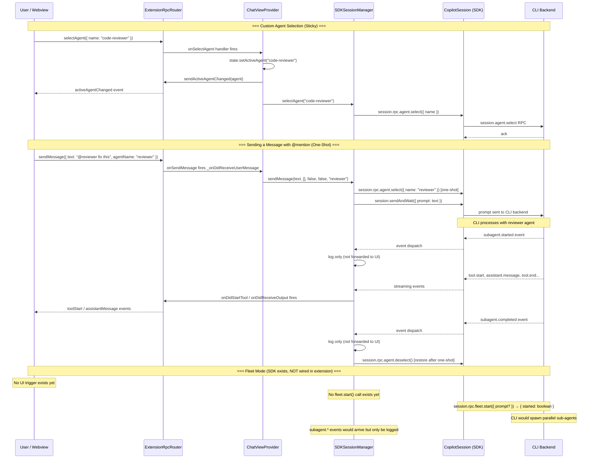

# Fleet Command & Subagent RPC Workflow

_Research spike — July 2025_

---

## What Is Fleet Mode?

**Fleet mode** is a Copilot CLI SDK concept that activates multi-agent parallelism for a session. When triggered via `session.fleet.start`, the CLI backend can spin up multiple concurrent sub-agents to work on different parts of a task simultaneously — a "fleet" of agents.

The SDK exposes this through a single RPC call:

```typescript
session.rpc.fleet.start({ prompt?: string }) → { started: boolean }
// → maps to: connection.sendRequest("session.fleet.start", { sessionId, ...params })
```

The `prompt` parameter is optional and allows combining a user instruction with the fleet orchestration instructions.

---

## Custom Agents vs. Fleet Sub-Agents

These are **two distinct concepts** in the SDK:

| Concept | SDK Namespace | Purpose |
|---------|--------------|---------|
| **Custom Agent** | `session.rpc.agent.*` | Select a named agent persona (e.g., `code-reviewer`) for a single message or the whole session |
| **Fleet** | `session.rpc.fleet.start` | Activate parallel multi-agent execution mode for the current task |
| **Sub-agent events** | `subagent.*` session events | Real-time lifecycle events emitted as fleet agents start/complete/fail |

---

## What Is Currently Implemented in the Extension

### ✅ Custom Agent Selection (Fully Wired)

The full round-trip for custom agent selection exists:

1. **Webview → Extension**: `selectAgent` RPC message with `{ name: string }`
2. **ExtensionRpcRouter**: `onSelectAgent()` handler → fires `_onDidSelectAgent`
3. **ChatViewProvider**: calls `state.setActiveAgent(name)`, fires `sendActiveAgentChanged`
4. **SDKSessionManager.selectAgent()**: calls `session.rpc.agent.select({ name })`
5. **Per-message one-shot**: `sendMessage(text, attachments, isRetry, skipEnhancement, agentName)` temporarily selects/deselects an agent for a single message
6. **Subagent events**: `subagent.started`, `subagent.completed`, `subagent.failed`, `subagent.selected`, `subagent.deselected` are all received and **logged** (lines 854–866 of sdkSessionManager.ts)

### ❌ Fleet Mode (`session.fleet.start`) — Not Yet Wired

The SDK exposes `session.rpc.fleet.start()` but **no code in the extension calls it**. It is not wired from:
- Webview (no fleet button/command exists)
- ExtensionRpcRouter (no fleet send/receive methods)
- ChatViewProvider (no fleet handler)
- SDKSessionManager (no `fleet.start()` call)

### ❌ Subagent Events — Not Forwarded to Webview

`subagent.started/completed/failed` are received by SDKSessionManager but only **logged** — they are not forwarded via EventEmitter to ChatViewProvider or surfaced in the UI.

---

## Full Call Path

### Custom Agent Selection Flow

```
Webview                         ExtensionRpcRouter          ChatViewProvider           SDKSessionManager          SDK / CLI
  │                                    │                           │                          │                       │
  │─selectAgent({ name })─────────────▶│                           │                          │                       │
  │                                    │─onSelectAgent─────────────▶│                          │                       │
  │                                    │                           │─selectAgent(name)─────────▶│                       │
  │                                    │                           │                          │─agent.select({ name })─▶│
  │                                    │                           │                          │                       │─session.agent.select RPC─▶CLI
  │                                    │                           │                          │                       │◀─ack─────────────────────│
  │◀──sendActiveAgentChanged(agent)─────│◀──sendActiveAgentChanged──│                          │                       │
```

### Per-Message @mention Agent Flow

```
Webview             ExtensionRpcRouter    ChatViewProvider      SDKSessionManager         SDK / CLI
  │                        │                    │                      │                      │
  │─sendMessage({          │                    │                      │                      │
  │   text, agentName })───▶│                    │                      │                      │
  │                        │─onSendMessage──────▶│                      │                      │
  │                        │                    │─sendMessage(text,     │                      │
  │                        │                    │  agentName)──────────▶│                      │
  │                        │                    │                      │─agent.select(name)───▶│
  │                        │                    │                      │─sendAndWait(prompt)───▶│
  │                        │                    │                      │                      │─[CLI processes with agent]
  │                        │                    │                      │◀──events (tool.*, assistant.*)──│
  │                        │                    │                      │─agent.deselect()──────▶│  (restore after)
  │◀──streaming events─────────────────────────────────────────────────│                      │
```

### Subagent Lifecycle Events (Received But Not Forwarded)

```
CLI Backend             SDK Session          SDKSessionManager        ChatViewProvider     Webview
     │                      │                      │                       │                 │
     │─subagent.started─────▶│                      │                       │                 │
     │                      │─session event────────▶│                       │                 │
     │                      │                      │ [LOG ONLY]             │                 │
     │                      │                      │ ✗ not forwarded        │                 │
     │─subagent.completed───▶│                      │                       │                 │
     │                      │─session event────────▶│                       │                 │
     │                      │                      │ [LOG ONLY]             │                 │
     │─subagent.failed──────▶│                      │                       │                 │
     │                      │─session event────────▶│                       │                 │
     │                      │                      │ [LOG ONLY]             │                 │
```

---

## Mermaid Sequence Diagram



---

## Gaps & "Not Yet Implemented" Notes

### 1. `session.fleet.start` — Completely Unwired

No part of the extension calls `session.rpc.fleet.start()`. To implement fleet mode:

- Add a fleet trigger in the UI (e.g., `/fleet` slash command or toolbar button)
- Add `sendFleetStart` / `onFleetStart` methods in `ExtensionRpcRouter`
- Add a fleet handler in `ChatViewProvider` → call `sdkSessionManager.startFleet(prompt?)`
- Implement `startFleet()` in `SDKSessionManager` calling `session.rpc.fleet.start()`

### 2. Subagent Events Not Surfaced in UI

`subagent.started`, `subagent.completed`, `subagent.failed` are received (lines 854–866 in sdkSessionManager.ts) and **only logged**. To surface them:

- Add `_onDidSubagentStart/Complete/Fail` EventEmitters in `SDKSessionManager`
- Wire them through `ChatViewProvider` → `ExtensionRpcRouter`
- Add webview handling in `ToolExecution.js` or `MessageDisplay.js` to show sub-agent progress

### 3. Custom Agent Definition Lifecycle (Fully Implemented)

Creating/editing/deleting custom agent definitions via `CustomAgentsService` is complete. The panel round-trip exists including `reloadAgents()` to refresh the SDK session after panel closes.

### 4. Session-Level Sticky Agent Survives Reconnects

`_restoreStickyAgentIfNeeded()` is called after session (re)creation, reading from `backendState.getActiveAgent()` to re-apply the sticky agent. This is implemented.

---

## SDK Reference Summary

| RPC Method | Maps To | Status |
|-----------|---------|--------|
| `session.rpc.fleet.start({ prompt? })` | `session.fleet.start` JSON-RPC | ❌ Not called |
| `session.rpc.agent.list()` | `session.agent.list` | ❌ Not called |
| `session.rpc.agent.getCurrent()` | `session.agent.getCurrent` | ❌ Not called |
| `session.rpc.agent.select({ name })` | `session.agent.select` | ✅ Called in sendMessage + selectAgent |
| `session.rpc.agent.deselect()` | `session.agent.deselect` | ✅ Called in deselectAgent + one-shot cleanup |

| Session Event | Data | Extension Handling |
|--------------|------|-------------------|
| `subagent.started` | `toolCallId, agentName, agentDisplayName, agentDescription` | Log only |
| `subagent.completed` | `toolCallId, agentName, agentDisplayName` | Log only |
| `subagent.failed` | `toolCallId, agentName, agentDisplayName, error` | Log only |
| `subagent.selected` | `agentName, agentDisplayName, tools[]` | Log only |
| `subagent.deselected` | `{}` | Log only |
